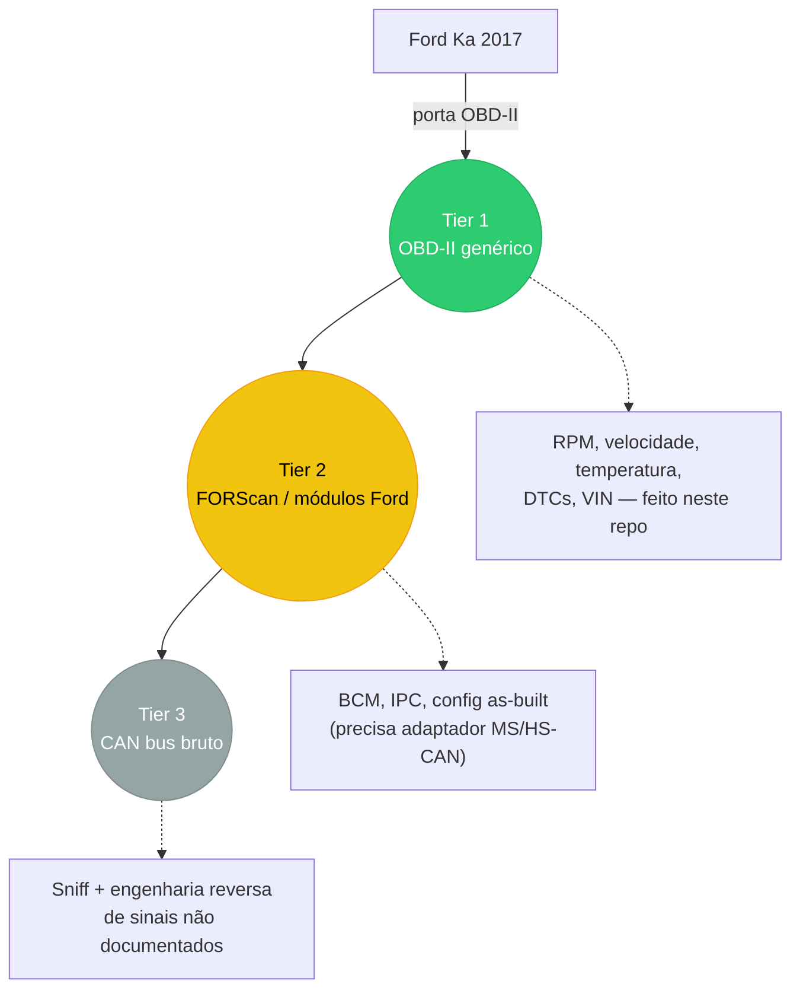
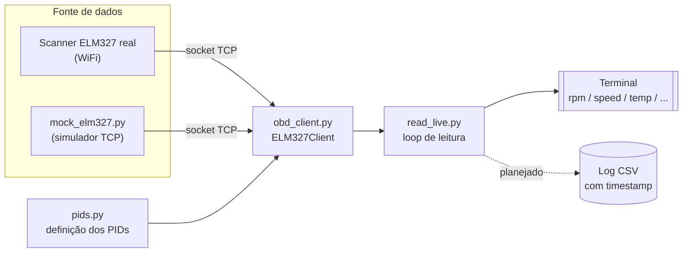

# Kruka OBD Project

Projeto de leitura/telemetria do Ford Ka 2017 (KRU) via OBD-II, com objetivo de
evoluir depois pra engenharia reversa do barramento CAN (ver histórico da
conversa pro plano completo de camadas: OBD genérico -> FORScan/módulos
Ford -> sniff bruto de CAN).

## Links

[](https://www.linkedin.com/in/kruka)
[](https://github.com/kruka)

## Visão geral do plano



Este repo cobre o **Tier 1**. Os próximos dois ainda são plano, não código.

## Hardware

Scanner ELM327 Bluetooth (Axscan, v2.1) — pareado com PIN `1234`.
Modo WiFi e recomendado para automacao (vira socket TCP simples, sem pareamento BT).
Modo Bluetooth serial funciona mas pode desconectar no Windows — o script tem reconexao automatica e o README tem os passos para estabilizar a conexao.

## Arquivos

- `pids.py` — definição dos PIDs OBD-II (modo 01) lidos hoje: rpm, speed,
  coolant_temp, throttle_position, intake_air_temp, engine_load, maf,
  fuel_level, battery_voltage. Fácil adicionar novos.
- `obd_client.py` — cliente ELM327 cru (sem lib python-obd), fala AT/OBD
  direto por WiFi (TCP) ou serial (COM port, quando pareado por Bluetooth/USB).
- `read_live.py` — script principal, lê PIDs em loop e imprime no terminal.
- `mock_elm327.py` — simula um ELM327 por TCP local, pra testar o client
  sem o scanner físico. Gera valores variando com o tempo (não fixos), pra
  validar de verdade o parsing.

## Arquitetura atual



`read_live.py` não sabe (nem precisa saber) se está falando com o carro
de verdade ou com o mock — os dois falam o mesmo protocolo ELM327 na
mesma porta TCP. Foi assim que a leitura foi validada antes do scanner
chegar.

## Uso

### WiFi (recomendado para automacao)

Quando o scanner estiver em modo WiFi (IP padrao costuma ser `192.168.0.10:35000`, conecta o PC na rede WiFi que o adaptador cria):

```
python read_live.py --wifi
```

### Bluetooth serial

Se o scanner pareou via Bluetooth mas desconecta no PC (problema conhecido com adaptadores ELM327 baratos no Windows), use o modo serial com reconexao automatica:

```
python read_live.py --bluetooth COM5
```

O `--baud` define a velocidade da porta serial (padrao `9600`). Se 9600 nao funcionar, tente `115200` ou `38400`.

**Pra resolver a desconexao no Windows:**
1. Gerenciador de Dispositivos → Portas (COM & LPT) → propriedades da porta serial do adaptador → Configuracoes da Porta → reduzir "Bits por segundo" para `9600` ou `110`
2. Desmarque "Permitir que o computador desligue este dispositivo para economizar energia" nas propriedades do adaptador Bluetooth
3. O script ja tem reconexao automatica — se a conexao cair, ele tenta reconectar a cada 3 segundos

### Testar sem o scanner (contra o mock)

```
python mock_elm327.py --port 35010
# em outro terminal:
python read_live.py --wifi --host 127.0.0.1 --port 35010
```

Ja validado localmente (init + decodificacao de rpm/speed/coolant/throttle/engine_load todos corretos contra o mock).

## Web App

O dashboard web permite visualizar as leituras OBD-II em tempo real pelo navegador.

### Executando

```
python main.py
```

Abra o navegador em `http://localhost:8000`.

### Funcionamento

- O dashboard conecta automaticamente ao scanner configurado (WiFi ou Bluetooth serial).
- Se a conexão cair, clique no botão **Retry** para reconectar.
- **Modo Bluetooth:** configure a porta COM na interface do dashboard.
- **Modo WiFi:** configure o IP e porta do scanner na interface do dashboard (ex.: `192.168.0.10:35000`).

## Próximos passos possíveis

- Validar com o scanner real assim que chegar.
- Ler DTCs (modo 03) e VIN (modo 09).
- Logar leituras em CSV com timestamp (base pra qualquer análise depois).
- Decidir sobre Tier 2 (adaptador MS/HS-CAN + FORScan) e Tier 3 (CANable +
  fluxo próprio de engenharia reversa de CAN, inspirado no skill da
  CSS Electronics mas sem depender do hardware CANsub).
