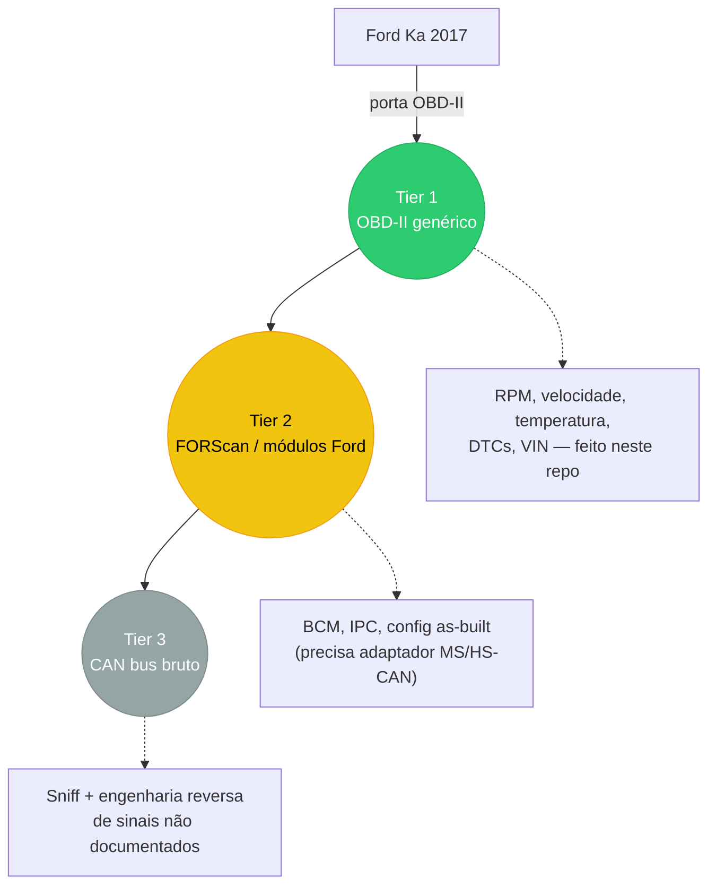
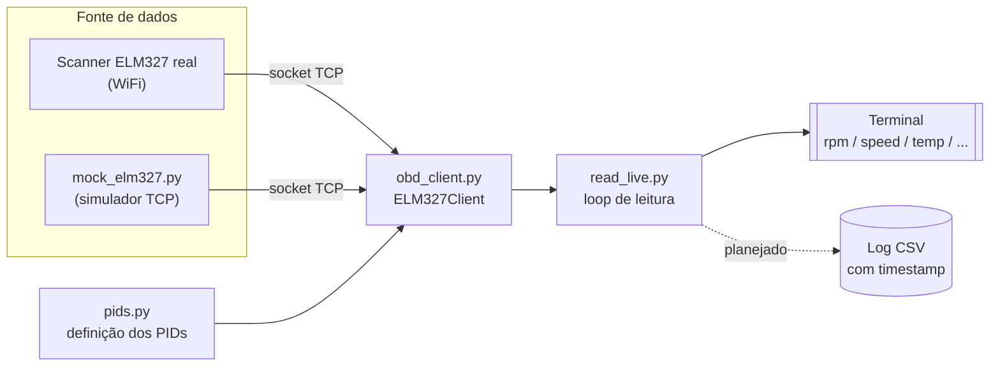

# ka-obd-lab

Parte 1 da série "projetos de garagem (de quarto)" — [parte 2 foi as luzes RGB](https://github.com/leonardobora/rgb-hub).

Projeto de leitura/telemetria do Ford Ka 2017 via OBD-II, com objetivo de
evoluir depois pra engenharia reversa do barramento CAN (ver histórico da
conversa pro plano completo de camadas: OBD genérico -> FORScan/módulos
Ford -> sniff bruto de CAN).

## Visão geral do plano



Este repo cobre o **Tier 1**. Os próximos dois ainda são plano, não código.

## Hardware

Scanner ELM327 WiFi/Bluetooth (Axscan, v2.1) — a caminho. Modo WiFi é o
recomendado pra automação (vira socket TCP simples, sem pareamento BT).

## Arquivos

- `pids.py` — definição dos PIDs OBD-II (modo 01) lidos hoje: rpm, speed,
  coolant_temp, throttle_position, intake_air_temp, engine_load, maf,
  fuel_level, battery_voltage. Fácil adicionar novos.
- `obd_client.py` — cliente ELM327 cru (sem lib python-obd), fala AT/OBD
  direto por WiFi (TCP) ou serial (COM port, quando pareado por Bluetooth/USB).
- `read_live.py` — script principal, lê PIDs em loop e imprime no terminal.
- `mock_elm327.py` — simula um ELM327 por TCP local, pra testar o client
  sem o scanner físico. Gera valores variando com o tempo (não fixos), pra
  validar de verdade o parsing.

## Arquitetura atual



`read_live.py` não sabe (nem precisa saber) se está falando com o carro
de verdade ou com o mock — os dois falam o mesmo protocolo ELM327 na
mesma porta TCP. Foi assim que a leitura foi validada antes do scanner
chegar.

## Uso

Quando o scanner chegar (modo WiFi, IP padrão costuma ser `192.168.0.10:35000`,
conecta o PC na rede WiFi que o adaptador cria):

```
python read_live.py --wifi
```

Testar sem o scanner (contra o mock):

```
python mock_elm327.py --port 35010
# em outro terminal:
python read_live.py --wifi --host 127.0.0.1 --port 35010
```

Já validado localmente (init + decodificação de rpm/speed/coolant/throttle/
engine_load todos corretos contra o mock).

## Próximos passos possíveis

- Validar com o scanner real assim que chegar.
- Ler DTCs (modo 03) e VIN (modo 09).
- Logar leituras em CSV com timestamp (base pra qualquer análise depois).
- Decidir sobre Tier 2 (adaptador MS/HS-CAN + FORScan) e Tier 3 (CANable +
  fluxo próprio de engenharia reversa de CAN, inspirado no skill da
  CSS Electronics mas sem depender do hardware CANsub).
